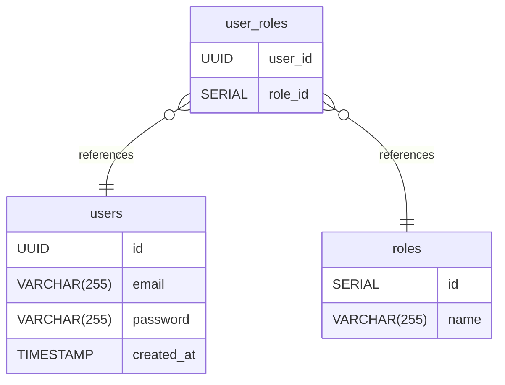

# Users DB documentation
## Summary

- [Introduction](#introduction)
- [Database Type](#database-type)
- [Table Structure](#table-structure)
	- [users](#users)
	- [roles](#roles)
	- [user_roles](#user_roles)
- [Relationships](#relationships)
- [Database Diagram](#database-diagram)

## Introduction

## Database type

- **Database system:** PostgreSQL
## Table structure

### users

| Name        | Type          | Settings                      | References                    | Note                           |
|-------------|---------------|-------------------------------|-------------------------------|--------------------------------|
| **id** | UUID | 🔑 PK, not null |  | |
| **email** | VARCHAR(255) | not null, unique |  | |
| **password** | VARCHAR(255) | not null |  | |
| **created_at** | TIMESTAMP | null |  | | 

### roles

| Name        | Type          | Settings                      | References                    | Note                           |
|-------------|---------------|-------------------------------|-------------------------------|--------------------------------|
| **id** | SERIAL | 🔑 PK, not null, unique |  | |
| **name** | VARCHAR(255) | not null |  | | 

### user_roles

| Name        | Type          | Settings                      | References                    | Note                           |
|-------------|---------------|-------------------------------|-------------------------------|--------------------------------|
| **user_id** | UUID | 🔑 PK, not null, unique | fk_user_roles_user_id_users | |
| **role_id** | SERIAL | 🔑 PK, not null | fk_user_roles_role_id_roles | | 

## Relationships

- **user_roles to users**: many_to_one
- **user_roles to roles**: many_to_one

## Database Diagram

